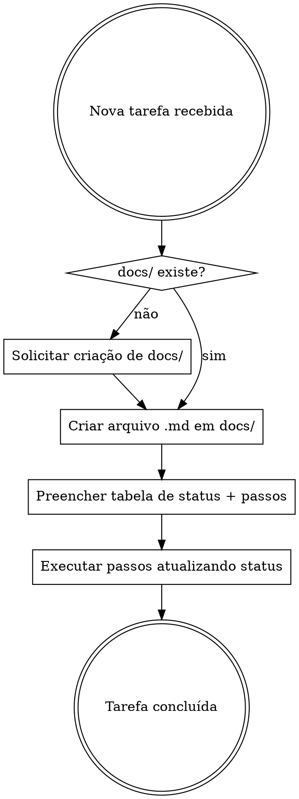

# Documentação Padrão

## Overview

Toda tarefa deve ser documentada em `docs/` com passos numerados e status rastreável **antes** de iniciar a implementação. O status de cada passo é atualizado conforme o progresso.

## Fluxo Obrigatório



## Regras

1. **Verificar `docs/`** — se não existir, perguntar ao usuário: _"A pasta docs/ não existe. Deseja que eu a crie?"_
2. **Criar arquivo** — nome descritivo em kebab-case: `docs/<nome-da-tarefa>.md`
3. **Tabela de status geral** — no topo do arquivo, com todos os passos e status
4. **Passos detalhados** — cada passo tem status individual, código completo e comando de verificação
5. **Atualizar status** — ao concluir cada passo, mudar o status no arquivo

## Ícones de Status

| Ícone | Significado |
|-------|-------------|
| ⬜ | Pendente |
| 🔄 | Em progresso |
| ✅ | Concluído |

## Modelo do Arquivo

```markdown
# [Nome da Tarefa]

**Objetivo:** [Uma frase descrevendo o que será feito]

**Tech Stack:** [Tecnologias utilizadas]

---

## Status Geral

| Passo | Descrição | Status |
|-------|-----------|--------|
| 1 | [Descrição curta] | ⬜ Pendente |
| 2 | [Descrição curta] | ⬜ Pendente |
| N | Commit | ⬜ Pendente |

---

### Passo 1: [Título do passo]

**Status:** ⬜ Pendente

**Arquivo:** Criar/Modificar `caminho/exato/do/arquivo`

**Ação:** [O que fazer]

\```linguagem
// código completo aqui
\```

**Verificação:**

\```powershell
comando-para-verificar
\```

Esperado: [resultado esperado]

---
```

## Regras dos Passos

- Cada passo = **uma ação** (2-5 minutos)
- **Código completo** — nunca usar "TODO", "implementar depois" ou "similar ao passo X"
- **Comando de verificação** — todo passo com código deve ter como testar
- **Caminhos exatos** — sempre incluir o caminho completo do arquivo
- **Último passo** — sempre é o commit

## Red Flags — PARE e Corrija

| Pensamento | Realidade |
|------------|-----------|
| "É tarefa simples, não precisa documentar" | Toda tarefa segue o padrão. Sem exceção. |
| "Vou documentar depois" | Documentação vem ANTES da implementação. |
| "Só vou colocar os passos sem código" | Código completo é obrigatório em cada passo. |
| "Não precisa de verificação" | Todo passo com código tem verificação. |
| "A pasta docs/ não existe, vou ignorar" | Pergunte ao usuário se quer criar. |
