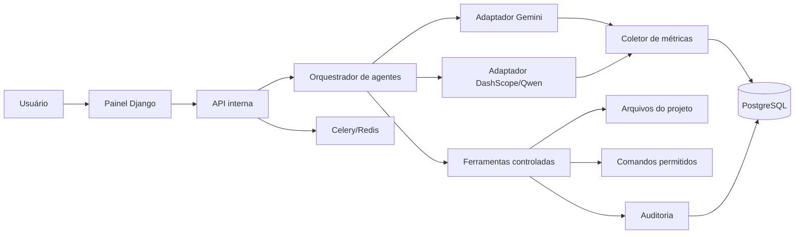

# Plataforma de Agentes de IA — Plano de Implementação

> **Para agentes executores:** implementar este plano por etapas, mantendo o acompanhamento de status neste arquivo. Por regra deste projeto, não criar nem executar testes automatizados, não abrir navegador e não iniciar servidor para validação.

**Objetivo:** Criar uma plataforma web em Django e Python para cadastrar agentes de IA, alternar provedores e modelos, executar tarefas com ferramentas controladas e acompanhar tokens, requisições, tempo e custo de cada agente.

**Arquitetura:** Um núcleo Django administra usuários, agentes, provedores, conversas, execuções e métricas. Cada provedor é acessado por um adaptador Python com uma interface comum; um orquestrador escolhe o agente, chama o modelo, executa somente ferramentas autorizadas e registra o consumo retornado pela API.

**Tech Stack:** Python, Django, Django REST Framework, PostgreSQL, Redis, Celery, HTML, CSS, JavaScript e APIs oficiais dos provedores.

**Status geral:** ⬜ Planejado

---

## 1. Visão do produto

A plataforma deve permitir:

- Cadastrar diferentes provedores de IA, inicialmente Google AI Studio e Alibaba DashScope.
- Criar vários agentes com nome, objetivo, instruções, modelo, provedor e permissões próprias.
- Alternar o agente ativo em uma conversa sem precisar abrir outro programa.
- Comparar respostas de dois ou mais agentes para a mesma solicitação.
- Visualizar consumo individual e consolidado por agente, modelo, provedor, usuário e período.
- Medir tokens de entrada, tokens de saída, total de tokens, requisições, duração, erros e custo estimado.
- Permitir que agentes autorizados leiam, criem e editem arquivos dentro de projetos cadastrados.
- Exigir aprovação antes de exclusões, comandos de terminal ou ações fora do escopo normal.
- Manter um histórico auditável de mensagens, ferramentas utilizadas e alterações realizadas.

### Decisão central

Para o painel de uso, a plataforma deve chamar diretamente as APIs do Gemini e do DashScope. Os programas `gemini` e `openclaude` podem continuar existindo como agentes de terminal, mas não devem ser a fonte principal das métricas, pois a captura de tokens e custos é mais confiável nas respostas das APIs.

---

## 2. Arquitetura proposta



### Componentes

1. **Painel Django:** interface para conversas, agentes, métricas e configurações.
2. **API interna:** endpoints autenticados consumidos pelo painel.
3. **Orquestrador:** controla o ciclo mensagem → modelo → ferramenta → modelo → resposta.
4. **Adaptadores:** normalizam as diferenças entre Gemini e DashScope.
5. **Executor de ferramentas:** limita arquivos e comandos ao projeto autorizado.
6. **Coletor de uso:** grava tokens, latência, status e custo de cada chamada.
7. **Fila de tarefas:** executa trabalhos longos sem bloquear a interface.
8. **Auditoria:** registra quem pediu, qual agente atuou e o que foi alterado.

---

## 3. Estrutura Django

```text
plataforma_ia/
├── manage.py
├── config/
│   ├── settings.py
│   ├── urls.py
│   ├── celery.py
│   └── wsgi.py
├── accounts/
│   ├── models.py
│   ├── views.py
│   └── urls.py
├── providers/
│   ├── models.py
│   ├── services/
│   │   ├── base.py
│   │   ├── gemini.py
│   │   └── dashscope.py
│   └── admin.py
├── agents/
│   ├── models.py
│   ├── services.py
│   ├── views.py
│   └── urls.py
├── conversations/
│   ├── models.py
│   ├── orchestrator.py
│   ├── tasks.py
│   ├── views.py
│   └── urls.py
├── tools/
│   ├── registry.py
│   ├── filesystem.py
│   ├── terminal.py
│   └── approvals.py
├── usage/
│   ├── models.py
│   ├── pricing.py
│   ├── reports.py
│   ├── views.py
│   └── urls.py
├── audit/
│   ├── models.py
│   └── services.py
├── templates/
├── static/
└── requirements.txt
```

---

## 4. Modelo de dados

### Provider

- `id`
- `nome`
- `codigo`: `gemini` ou `dashscope`
- `ativo`
- `variavel_chave`: somente o nome, como `GEMINI_API_KEY` ou `DASHSCOPE_API_KEY`
- `base_url`
- `configuracao_json`
- `criado_em`
- `atualizado_em`

As chaves não devem ser gravadas nessa tabela. O backend deve obtê-las das variáveis de ambiente ou de um cofre de segredos.

### AIModel

- `provider_id`
- `codigo_api`
- `nome_exibicao`
- `context_window`
- `preco_entrada_por_milhao`
- `preco_saida_por_milhao`
- `suporta_ferramentas`
- `suporta_imagens`
- `ativo`

### Agent

- `nome`
- `slug`
- `descricao`
- `instrucoes_sistema`
- `modelo_id`
- `temperatura`
- `limite_passos`
- `ativo`
- `permissoes_json`
- `criado_por_id`

### Project

- `nome`
- `caminho_raiz`
- `ativo`
- `permite_leitura`
- `permite_edicao`
- `permite_terminal`
- `comandos_permitidos_json`

### Conversation e Message

- Conversa vinculada ao usuário, projeto e agente atual.
- Mensagem com papel `system`, `user`, `assistant` ou `tool`.
- Registro do provedor e modelo realmente utilizados em cada resposta.
- Possibilidade de trocar o agente mantendo ou reiniciando o contexto.

### AgentRun

- `agent_id`
- `conversation_id`
- `provider_id`
- `model_id`
- `status`: `PENDENTE`, `EXECUTANDO`, `CONCLUIDO`, `ERRO` ou `CANCELADO`
- `iniciado_em`
- `finalizado_em`
- `duracao_ms`
- `erro_resumido`

### UsageRecord

- `agent_run_id`
- `input_tokens`
- `output_tokens`
- `cached_tokens`
- `total_tokens`
- `request_count`
- `estimated_cost`
- `currency`
- `usage_source`: `provider`, `calculated` ou `unavailable`
- `raw_usage_json`

### ToolExecution e Approval

- Ferramenta solicitada, parâmetros saneados, resultado e duração.
- Usuário que aprovou ou recusou a ação.
- Hash do conteúdo antes e depois de uma edição.
- Nunca salvar valores de variáveis secretas nos parâmetros ou logs.

---

## 5. Interface comum dos provedores

Todos os adaptadores devem implementar o mesmo contrato:

```python
from dataclasses import dataclass
from decimal import Decimal
from typing import Any


@dataclass(frozen=True)
class UsageData:
    input_tokens: int
    output_tokens: int
    cached_tokens: int
    total_tokens: int
    estimated_cost: Decimal | None
    raw: dict[str, Any]


@dataclass(frozen=True)
class ProviderResponse:
    text: str
    tool_calls: list[dict[str, Any]]
    usage: UsageData
    provider_request_id: str | None


class BaseProvider:
    def generate(self, *, model: str, messages: list[dict], tools: list[dict]) -> ProviderResponse:
        raise NotImplementedError
```

### GeminiAdapter

- Ler exclusivamente `GEMINI_API_KEY`.
- Usar a API do Google AI Studio.
- Converter function calling do Gemini para o contrato comum.
- Capturar os metadados de uso devolvidos pela API.

### DashScopeAdapter

- Ler exclusivamente `DASHSCOPE_API_KEY`.
- Usar a API compatível com OpenAI ou o SDK oficial da Alibaba.
- Converter tool calls para o contrato comum.
- Capturar tokens retornados pelo provedor.

---

## 6. Funcionamento do agente

1. O usuário seleciona um projeto, uma conversa e um agente.
2. O backend cria um `AgentRun` com status `PENDENTE`.
3. O orquestrador carrega instruções, histórico e ferramentas permitidas.
4. O adaptador envia a solicitação ao provedor configurado.
5. Se o modelo pedir uma ferramenta, o registro é criado antes da execução.
6. A política determina se a ferramenta pode executar automaticamente ou exige aprovação.
7. O resultado da ferramenta retorna ao modelo.
8. O ciclo continua até uma resposta final ou até atingir o limite de passos.
9. Tokens e custo são gravados em `UsageRecord` a cada chamada.
10. O `AgentRun` é finalizado com duração e status.

### Alternância de agentes

O usuário poderá escolher entre:

- **Continuar com contexto:** o novo agente recebe o histórico da conversa.
- **Novo contexto:** cria uma ramificação sem mensagens anteriores.
- **Comparar agentes:** envia a mesma mensagem a vários agentes e exibe as respostas lado a lado.
- **Fallback automático:** usa outro agente quando o provedor principal falhar ou atingir o limite definido.

---

## 7. Painel de consumo

### Indicadores principais

- Tokens de entrada, saída e total.
- Quantidade de requisições.
- Custo estimado por agente.
- Custo por provedor e modelo.
- Tempo médio de resposta.
- Taxa de erro.
- Quantidade de ferramentas executadas.
- Agente mais utilizado.

### Filtros

- Hoje, últimos 7 dias, mês atual e intervalo personalizado.
- Usuário.
- Agente.
- Provedor.
- Modelo.
- Projeto.
- Status da execução.

### Telas do MVP

1. Login.
2. Dashboard geral.
3. Cadastro de provedores e modelos.
4. Cadastro de agentes.
5. Chat com seletor de agente.
6. Comparação de agentes.
7. Execuções em andamento.
8. Relatório de consumo.
9. Auditoria de ferramentas e alterações.
10. Aprovações pendentes.

---

## 8. Segurança

- Nunca armazenar chaves de API no banco, no frontend, em commits ou em logs.
- Ler `GEMINI_API_KEY` e `DASHSCOPE_API_KEY` somente no backend.
- Não enviar chaves ao navegador.
- Resolver e validar o caminho absoluto antes de qualquer operação de arquivo.
- Bloquear acesso fora da raiz cadastrada do projeto.
- Proibir comandos destrutivos por padrão.
- Executar comandos por lista de argumentos, sem concatenar texto em shell.
- Solicitar aprovação para exclusões, instalações, comandos Git de publicação e acesso externo.
- Limitar tamanho de arquivos, duração de comandos e número de passos do agente.
- Mascarar segredos conhecidos em mensagens, resultados e auditoria.
- Aplicar autenticação, autorização por perfil, CSRF e rate limiting.
- Manter backup e retenção configurável do histórico.

---

## 9. Endpoints principais

```text
GET    /api/agents/
POST   /api/agents/
PATCH  /api/agents/{id}/
GET    /api/providers/
GET    /api/models/
POST   /api/conversations/
POST   /api/conversations/{id}/messages/
POST   /api/conversations/{id}/switch-agent/
POST   /api/conversations/{id}/compare/
GET    /api/runs/
POST   /api/runs/{id}/cancel/
GET    /api/usage/summary/
GET    /api/usage/by-agent/
GET    /api/usage/by-provider/
GET    /api/approvals/
POST   /api/approvals/{id}/approve/
POST   /api/approvals/{id}/reject/
GET    /api/audit/
```

---

## 10. Etapas de implementação

### Etapa 1 — Fundação Django

**Status:** ⬜ Pendente

- Criar projeto Django e os aplicativos definidos na estrutura.
- Configurar PostgreSQL, variáveis de ambiente e autenticação.
- Criar os modelos `Provider`, `AIModel`, `Agent` e `Project`.
- Disponibilizar os cadastros no Django Admin.

### Etapa 2 — Provedores e métricas

**Status:** ⬜ Pendente

- Implementar `BaseProvider`.
- Implementar `GeminiAdapter` com `GEMINI_API_KEY`.
- Implementar `DashScopeAdapter` com `DASHSCOPE_API_KEY`.
- Persistir `AgentRun` e `UsageRecord`.
- Calcular custo somente quando houver preço cadastrado.

### Etapa 3 — Conversas e alternância

**Status:** ⬜ Pendente

- Criar modelos de conversa e mensagem.
- Criar o chat Django.
- Adicionar seletor de agente.
- Implementar troca com contexto, novo contexto e comparação.

### Etapa 4 — Ferramentas seguras

**Status:** ⬜ Pendente

- Criar registro central de ferramentas.
- Implementar leitura, busca, criação e edição controlada de arquivos.
- Implementar execução limitada de comandos.
- Criar fluxo de aprovação e auditoria.

### Etapa 5 — Processamento assíncrono

**Status:** ⬜ Pendente

- Configurar Redis e Celery.
- Mover execuções longas para tarefas assíncronas.
- Atualizar o frontend com polling ou eventos enviados pelo servidor.
- Permitir cancelamento de execuções.

### Etapa 6 — Dashboard e relatórios

**Status:** ⬜ Pendente

- Criar cartões de indicadores.
- Criar gráficos por agente, provedor, modelo e período.
- Criar detalhamento por execução.
- Exportar relatórios em CSV.

### Etapa 7 — Segurança e produção

**Status:** ⬜ Pendente

- Aplicar perfis e permissões.
- Implementar mascaramento de segredos.
- Configurar limites de uso e orçamento por agente.
- Preparar implantação com servidor de aplicação, banco e fila.
- Documentar backup, restauração e rotação de credenciais.

---

## 11. Critérios de aceite do MVP

- O usuário consegue cadastrar ao menos um agente Gemini e um agente Qwen.
- As chaves permanecem exclusivamente no ambiente do backend.
- É possível conversar e alternar agentes pela mesma tela.
- Cada chamada gera um registro de consumo associado ao agente correto.
- O dashboard apresenta tokens e requisições separados por agente.
- O custo aparece como estimado e identifica quando o provedor não fornece todos os dados.
- O agente só acessa arquivos dentro do projeto selecionado.
- Edições ficam registradas na auditoria.
- Ações sensíveis aguardam aprovação humana.
- Falhas de provedor não apagam o histórico nem deixam execuções indefinidamente abertas.

---

## 12. Evoluções futuras

- Adicionar OpenAI, Anthropic, Ollama e outros provedores.
- Criar equipes de agentes especializados.
- Implementar roteamento automático por custo, velocidade ou qualidade.
- Definir orçamento diário e mensal por usuário ou agente.
- Adicionar memória vetorial por projeto.
- Integrar repositórios Git e revisão de alterações.
- Criar marketplace interno de agentes e ferramentas.
- Permitir agendamentos e automações recorrentes.
- Enviar alertas quando consumo ou custo ultrapassar limites.
- Disponibilizar API pública com tokens de acesso próprios da plataforma.

---

## 13. Orientação para início

Começar pelo MVP com Django, PostgreSQL e chamadas síncronas. Adicionar Celery e Redis quando as primeiras execuções longas justificarem processamento em segundo plano. Implementar primeiro o chat e a medição de uso; liberar ferramentas de edição somente depois que isolamento, aprovação e auditoria estiverem prontos.
